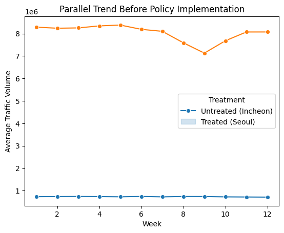
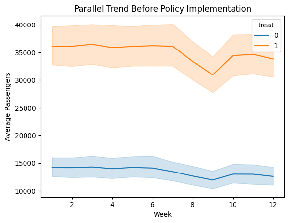
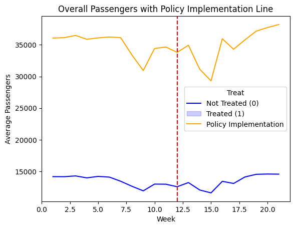
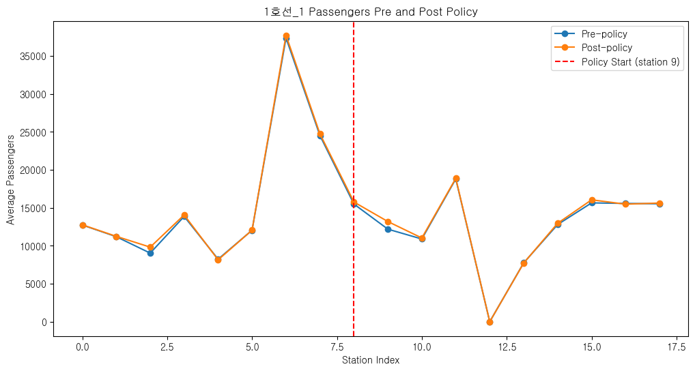

# 기후동행카드 정책 유효성 평가 인과추론 프로젝트

## 프로젝트 개요
이 프로젝트는 2024년 1월 27일부터 시작된 기후동행카드 정책의 유효성을 평가하기 위한 인과추론 연구입니다. 기후동행카드는 한 번의 요금 충전으로 30일간 대중교통(지하철, 버스)을 무제한 이용할 수 있는 대중교통 통합 정기권으로, 독일 티켓과 유사한 성격을 가집니다. 다만, 특정 역에서만 사용이 가능합니다 (참고: [이미지](https://mediahub.seoul.go.kr/uploads/mediahub/2024/01/rXwscZCVwGGNWqglGCHRtEcFVhBYhUmY.jpg)).

## 정책의 필요성
[서울 솔루션](https://seoulsolution.kr/ko/content/10019)에 따르면, 기후동행카드 이용자 중 4%가 승용차 대신 대중교통을 이용한다는 설문 결과가 발표되었습니다. 그러나, 비용이 수반되는 정책인 만큼, 정책이 얼마나 유의미했는지 확인하는 일은 중요합니다. 이러한 연구는 독일 티켓처럼 다른 국가에서도 참고할 수 있는 사례가 될 수 있습니다.

## Research Design
본 연구에서는 다음과 같은 아이디어를 시도했습니다:

1. **서울의 교통량 변화 분석**:
   - **Treated Group**: 서울
   - **Control Group**: 인천
   - **방법론**: Difference in Difference
   - **Research Question**: 정책 적용 이후, 서울은 비슷한 근접 지역보다 교통량이 줄었을까?

2. **지하철 승객 수 변화 분석**:
   - **Treated Group**: 수도권 지하철 중 정책 적용 역
   - **Control Group**: 수도권 지하철 중 정책 미적용 역
   - **방법론**: Difference in Difference
   - **Research Question**: 정책 적용 이후, 수도권 지하철 중에서 기후동행카드 사용 가능한 역은 그렇지 않은 역에 비해 탑승객이 늘었을까?

3. **정책 적용 경계 분석**:
   - **방법론**: Regression-Discontinuity-Design
   - **Research Question**: 일렬로 이어지는 지하철 중 가운데 일부가 적용되고, 외곽이 적용되지 않은 경우, 1개 역 차이일 만큼 지리적으로 인접한 2개의 treated station과 untreated station을 비교하여 정책 적용 이후, discontinuity가 더 커지는 것을 확인할 수 있을까?

각 실험에 대한 분석은 `vehicles_did.ipynb`, `metro_did.ipynb`, `metro_rdd.ipynb`에서 수행되었습니다.

## Data
1. 서울 교통량: [TOPIS](https://topis.seoul.go.kr/refRoom/openRefRoom_2.do)
2. 인천 교통량: [인천교통공사](https://www.fitic.go.kr/stat/VDS.do)
3. 서울시 지하철호선별 역별 승하차 인원 정보: [서울시 데이터](https://data.seoul.go.kr/dataList/OA-12914/S/1/datasetView.do)
4. 기후동행카드 노선 정보: [서울시 뉴스](https://news.seoul.go.kr/traffic/archives/510651)

## Result
1. **서울과 인천의 교통량 변화**:
   - 서울과 인천의 평행 추세(parallel trend)가 확인되지 않아 이중차분법의 적용이 불가능했습니다.
   - 
   
2. **지하철 승객 수 변화**:
   - 기후동행카드 정책 시행 전 시기, 유의미한 parallel trend가 확인되었고, 이중차분법의 결과, 정책 적용이 탑승객 수 변화에 유의미한 영향을 주지 않는 것으로 나타났습니다.
   - 
   - 

3. **정책 적용 경계의 변화**:
   - 5개의 구간을 분석한 결과, 유의미한 discontinuity 증가 경향성이 확인되지 않았습니다.
   - 

본 연구를 통해 기후동행카드가 교통량 감소나 지하철 탑승객 증가에 유의미한 영향을 주지 않는다는 결론을 내렸습니다. 

## 문의 및 피드백
프로젝트에 대한 문의나 비판은 언제든 환영합니다. 보다 자세한 내용을 알고 싶거나 의견이 있으시면 연락 주시기 바랍니다.